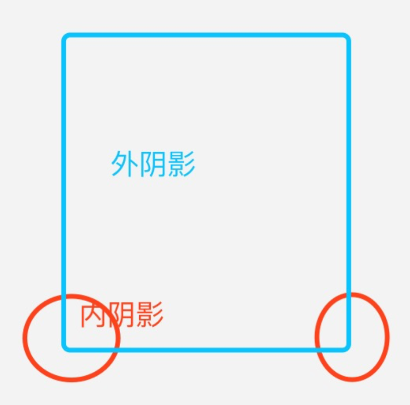
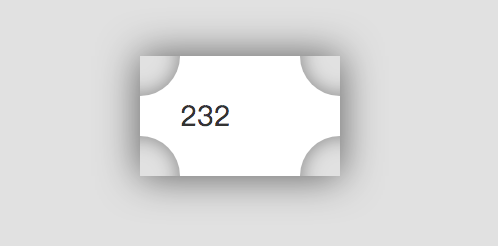
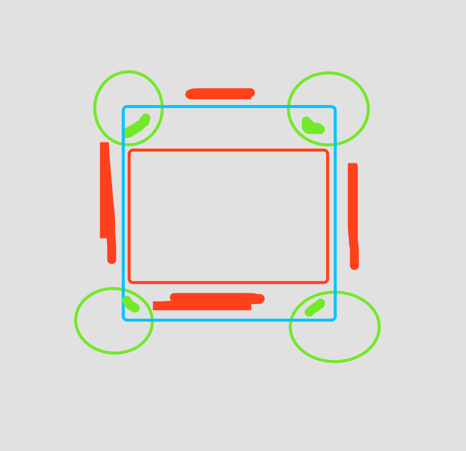
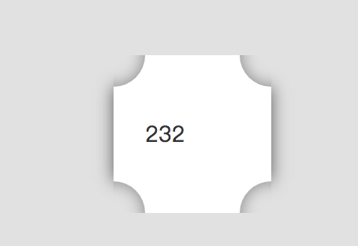
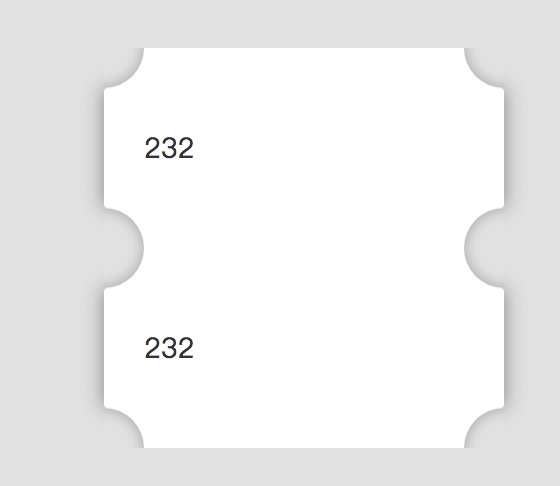
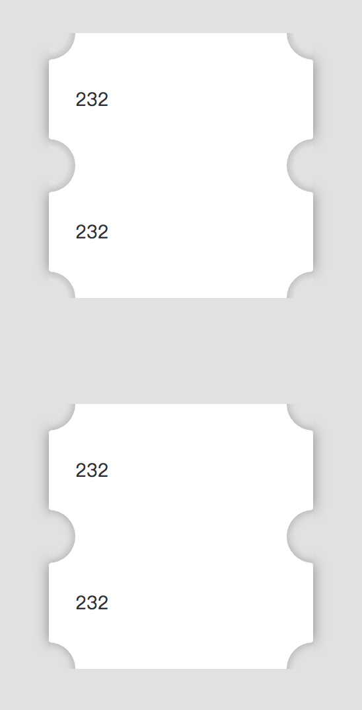
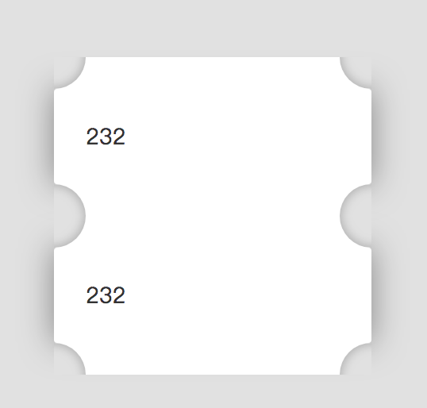

# CSS 阴影效果小实践

实现目标：阴影以及向内圆角阴影

**初步想法**

矩形四周用园盖住，矩形是外阴影，圆是内阴影。

最后效果很奇怪，宣告失败。

**优化一下**

需要控制一下阴影，不能在整个矩形四周，内容区域是两边，然后用圆圈的内阴影连接。

初次有个看起来比较像的样子了，还有一定的优化空间。

**优化一下 2**

最初的圆角是通过整个园隐藏四分之一的方式，会出现在 90° 的 N 倍处会有向内明显的痕迹。

接下来可以通过一个矩形四分之一弧形的方式，可以比较好的避免切割的痕迹。在配合阴影 x y 轴倾斜，效果更好。

内容区、园连接处直愣愣的，加上一点圆角，视觉上好一点了。

圆形内除了阴影，也可以用渐变实现。

上面用的渐变，我对渐变不熟，阴影的效果不是很好。

视觉上，两者差距并不大。

**问题**

阴影的扩散越大，BUG 越明显。

