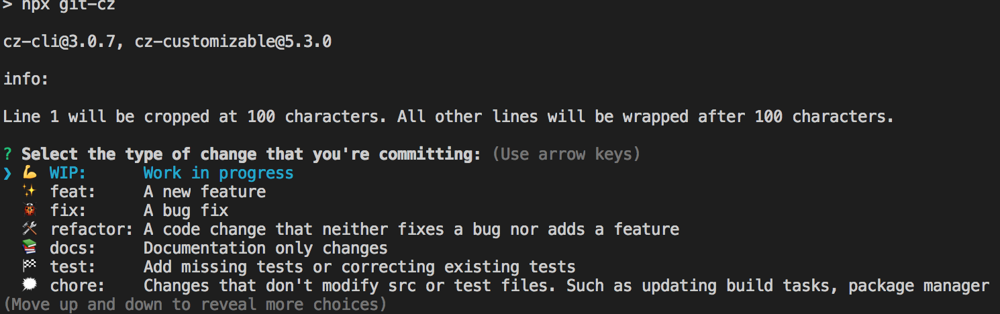
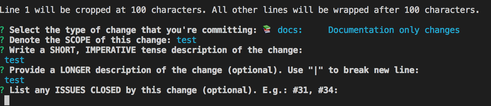
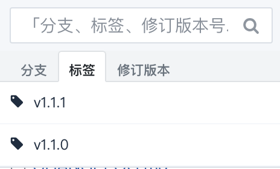

# git-commitizen 练习

> 参考文章：[优雅的提交你的 Git Commit Message](https://juejin.im/post/5afc5242f265da0b7f44bee4)

## 依赖库

* commitizen git message 提交工具
* cz-customizable 自定义 message
* standard-version 版本生成器

### commitizen

可以全局安装，也可以项目安装。

全局安装使用 `git-cz` 命令编写 git message；项目安装使用 `git-cz`，此时需要 `NPM 5.2+`。

### cz-customizable

自定义 message 格式。

如果不自定义，可以使用 `cz-conventional-changelog` 这个通用的包。

修改 package.json

*cz-customizable*

```json
{
  "config": {
    "commitizen": {
      "path": "node_modules/cz-customizable"
    }
  }
}
```

*cz-conventional-changelog*

```json
{
  "config": {
    "commitizen": {
      "path": "node_modules/cz-conventional-changelog"
    }
  }
}
```

### standard-version

> Automate versioning and CHANGELOG generation, with semver and conventional commit messages.

修改 package.json

```json
{
  "scripts": {
    "release": "standard-version"
  }
}
```

## 使用

正常修改文件，命令行 `git add .` 添加修改的问题文件。

`npm run commit` 填写 git message。




`git push` 提交代码。

`npm run release` 在项目根目录自动生成 CHANGELOG.md 文件，并且生成 `标签`。



目前感觉已经够用了。

## 其他

如果要配合 `standard-version` 生成日志，自定义规则里面 value 值需要对应上 `conventional-changelog`。

> uses conventional-changelog to update CHANGELOG.md